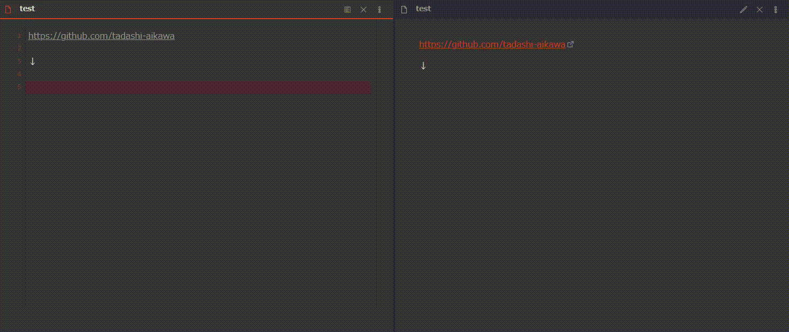
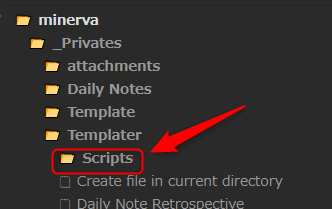
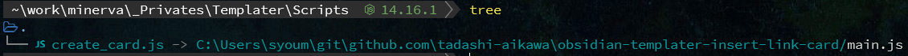
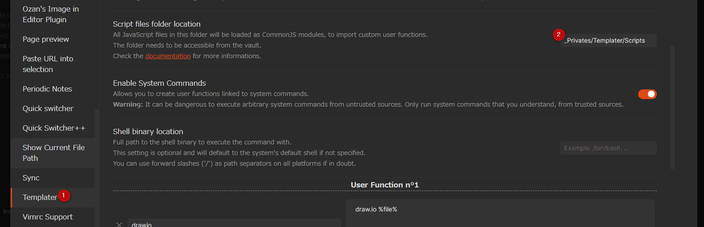

# Obsidian Templater Insert link card

This repository is snippets that enable inserting a link as a card using [Templater], the [Obsidian] plugin.

## Demo



## Requirements

You need to install [Obsidian] (>= v0.12.11) and [Templater].

## Get started

① Create a **Scripts directory** for using [Script User Functions] on [Templater]. For example, `_Privates/Templater/Scripts`



② Copy or link `main.js` to the **Scripts directory**



③ Set **Scripts directory** to `Templater > Script files folder location`



④ Copy definitions of `main.css` to your CSS files (`CSS snippets` / `publish.css`)

⑤ Create a template as follows

`Insert Link Card.md`

```js
<%*
const DESC_MAX_LEN = 100

const url = await tp.system.prompt("Enter URL", DESC_MAX_LEN)
if (url) {
  tR = await tp.user.create_card(url)
}
%>
```

Now, you can create a card link as HTML from the URL.

[templater]: https://github.com/SilentVoid13/Templater
[obsidian]: https://obsidian.md/
[script user functions]: https://silentvoid13.github.io/Templater/docs/user-functions/script-user-functions
